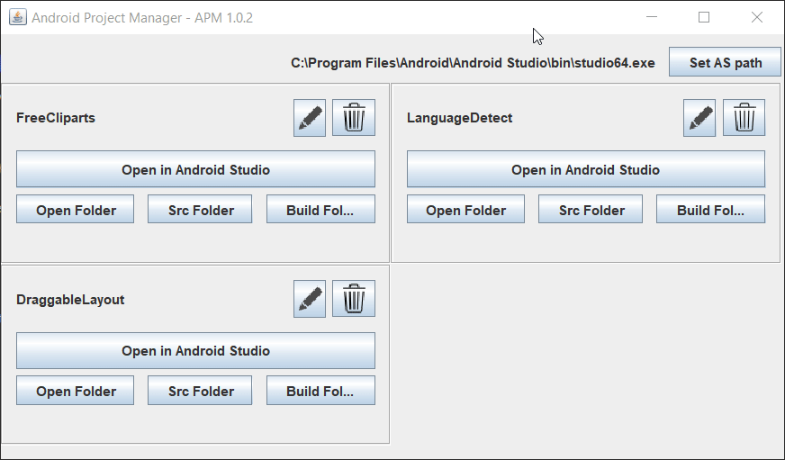

# AndroidProjectManager v1.0.2 ( aug 2020 update )
## Desktop application to manage your android projects

**Here's it in Action**

## [Download Now (jar executable)](https://github.com/monsterbrain/AndroidProjectManager/releases/tag/v1.0.2)
*Tested on windows OS. If any issues please file an [issue here](https://github.com/monsterbrain/AndroidProjectManager/issues)*

## ChangeLog
-- v 1.0.2
 - Modify project display name
 - Remove the projects from the list
 - all new Fit layout
-- v 1.0.1 beta
 - You can now open projects in Android Studio directly

## How to use
- Run the program and **Drag & Drop** an Android project folder (containing build.gradle).
- The project with name (**same as Folder**) will be added to window.
- Directly open the project in Android Studio
- Clicking the buttons will open corresponding folder
- More features to be added later ...

## Why I needed this ?
- Each time you have to go through project folder -> app -> build / main -> src -> com -> etc etc
- The Show in explorer function in Android Studio is Slow. For finding a project folder, opening it in
Android studio is an overkill I guess.

## Contributing
 Contributors are welcome to add new features, post any issues etc.
 
## Technologies used
- Apache Netbeans 11.3 IDE
- Java Swing for UI
- Lombok for @data
- Gson for json handling

*[Monster Brain](http://monsterbraininc.com) - 2020*
